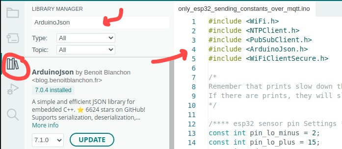
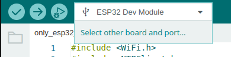
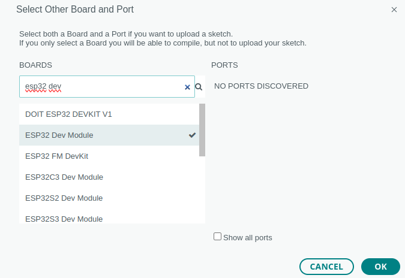
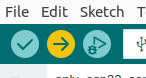
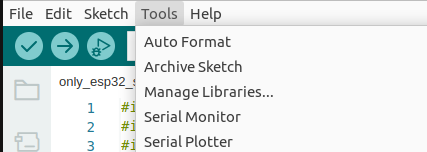

OS: Linux
Arduino version: 2.3.2
Version: 22.04 LTS - Jammy (Ubuntu)

# Récupréation du projet depuis gitlab

1. Cloner ce dépôt sur votre machine locale :
```bash
    git clone https://gitlab.ig.umons.ac.be/rami-1/sensors-over-mqtt.git
    cd sensors-over-mqtt
```

# L'IDE Arduino
Si vous souhaitez prendre en main Arduino, je vous conseille vivement de commencer par manipuler le fichier .ino du dossier suivant:
du dossier suivant:
```bash
sensors-over-mqtt/esp32-mqtt/only_esp32_sending_constants_over_mqtt/only_esp32_sending_constants_over_mqtt.ino
```

## Téléchargement d'Arduino

Vous devez installer une version supérieure à la version 2.0. Voici le lien de téléchargement:
https://docs.arduino.cc/software/ide-v2/tutorials/getting-started/ide-v2-downloading-and-installing/

## Utilisation d'Arduino
### Prérequis pour la manipulation d'Arduino

Pour utiliser Arduino, il y a certains points à garder en tête.
- Premièrement, le fichier .ino utilise du C++. Arduino impose que le fichier .ino soit dans le dossier portant le nom du fichier.
- Deuxièmement, rappelons que l'IDE permet de compiler et d'envoyer du code compilé sur le microcontrôleur de notre choix. Voici ce que cela implique :

#### 1. Utilisation du langage compilé (C++)

**Librairies** : Arduino utilise le langage C++ pour programmer les microcontrôleurs. Cela signifie que vous devrez importer les bibliothèques nécessaires à votre projet.

> **[UNE FOIS] Import** : Vous allez devoir installer les librairies nécessaires via le gestionnaire de bibliothèques de l'IDE Arduino.



#### 2. Envoi du code sur du matériel

**Les Boards** : On définit le "board" afin que l'IDE Arduino assure que le code est correctement compilé et téléversé, en tenant compte des spécificités matérielles et des ressources disponibles.

> **[A CHAQUE CHANGEMENT DE MICROCONTROLEUR] Choisir un board** : Vous allez devoir choisir le board correspondant à votre microcontrôleur.





### Conseils généraux pour la manipulation d'Arduino

1) VÉRIFIER le positionnement des pins, si nécessaire. Ils doivent correspondre à ceux indiqués dans votre code !!!
2) Compiler et Flasher sur la carte, NB: POUR LA COMPILATION, VOIR LA PARTIE "3. L'utilisation du fichier.ino" dans le fichier
README.md correspondant au microcontroller que vous souhaitez utiliser !



3) Voir les données
- Serial plotter (affiche le graphique des valeurs envoyées et/ou recensées)
- Serial monitor (affiche les print du programme)



> Attention, le nombre de bauds doit correspondre à celui indiqué dans le fichier correspondant (sinon vous verrez des caractères bizarres)


## Problèmes que vous pourriez rencontrer et solutions

### Absence de Serial
- Installer python3 (version supérieure à 3.6) puis pyserial
```bash
sudo apt update
sudo apt install python3
sudo apt install python3-serial
```
		     
### Ports does not exits (alors que vous avez branché votre esp/lora)
- Changer les permissions concernant le port: (Relancer la commande si l'erreur s'affiche à nouveau)
```bash
sudo chmod 666 /dev/ttyUSB0
```

### Parfois, le flashage s'arrête subitement ou alors le monitor affiche des caractères bizzares meme si les bauds sont correctes... (lisez cette solution en entier avant de l'essayer)
/!\ Il faut etre précis
- Téléverser le code
- AVANT que connecting n'apparaisse, vous devez appuyer et maintenur les deux boutons (généralement RST et BOOT) le temps que le flashage reprenne
- relacher les deux boutons


### Impossibilité de connecter les microcontroleurs au wifi
1) Les microcontrôleurs comme l'esp32 et la lora ne se connectent pas à n'importe quel réseau wifi (ils n'en ont pas la capacité), **Priviligiez le partage de connnexion**

Compléter le fichier avec les erreurs que vous rencontrez !!!
